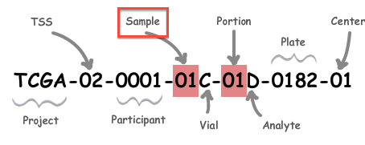
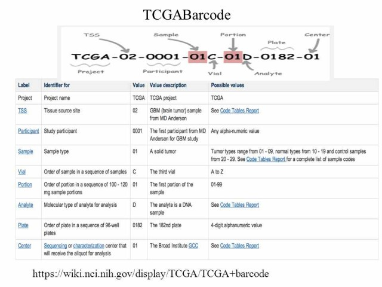

TCGAbarcode
================

The orginal NIH documentation on TCGA barcodes, preserved. In response to: https://www.biostars.org/p/313063/

Extra information on the fields in the barcode (also see figure below): <a href="TCGAbarcode.pdf">View Saved PDF</a>

*Code Tables Report* can be found at [TCGA Code Tables](https://gdc.cancer.gov/resources-tcga-users/tcga-code-tables) (courtesy dariober)

